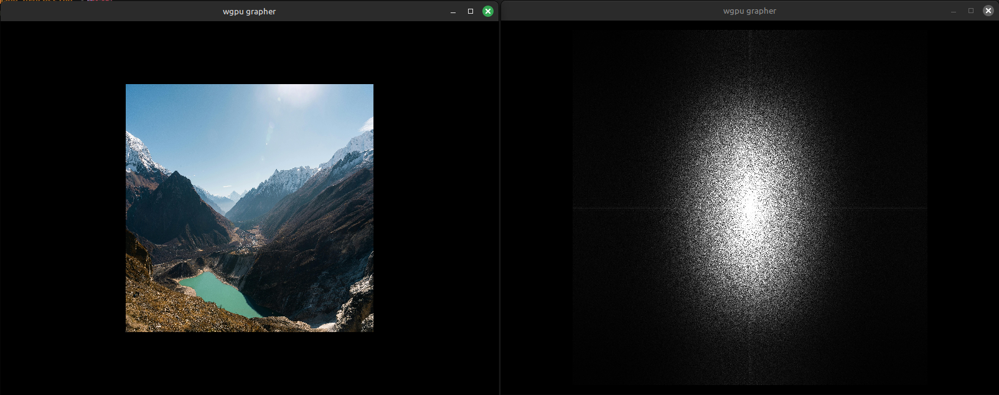
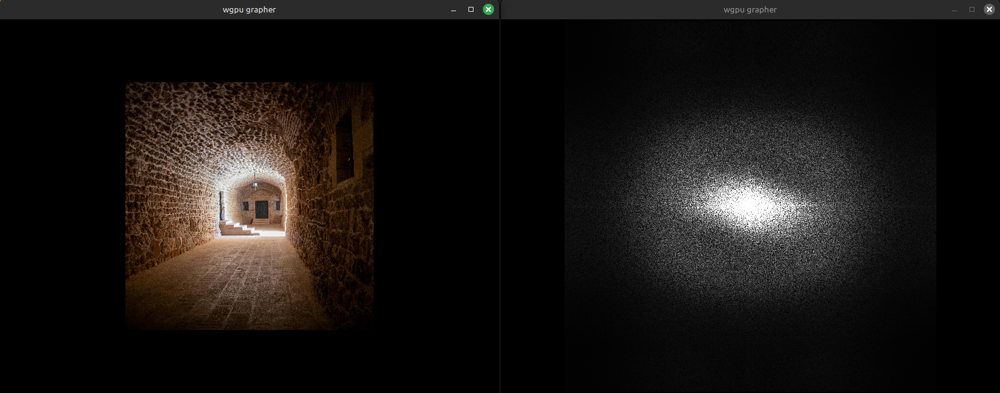
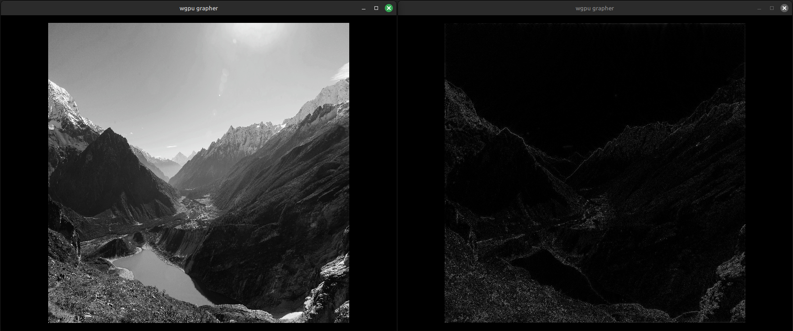

# Another FFT

This is a Rust crate implementing the Fast Fourier Transform.
It's called _another_ FFT because there are already crates with great
FFT implementations. This one is more of a personal project for experimenting with the
various FFT implementations that are out there and some applications. Who knows, maybe
someday it will find some niche that isn't filled by existing libraries. Or maybe not,
and that's fine too.

It currently has the FFT implementation from

```text
Press, et al., _Numerical Reciples_, Third Edition.
Cambridge University Press, 2007.
```

which the authors credit to N.M. Brenner.

## Image processing

I've implemented a 2D FFT and added an `image_processing` crate that provides several
operations, including the FFT, on image files.

Here are some examples of images with their FTs:

<p align="center" margin="20px">
        
</p>

<p align="center" margin="20px">
        
</p>

In fact the images shown are the magnitudes of the Fourier coefficients, which are in general complex,
and the images are converted to grayscale before the FT is taken.

**Frequency space filtering:**

I've also implemented a basic Fourier-space filter, as an example of the kinds of things that can be done.
This allows us to apply a multiplier to the Fourier coefficients of the image.
The [Convolution Theorem](https://en.wikipedia.org/wiki/Convolution_theorem) says that this is equivalent
to convolving the image with a corresponding kernel, but some kernels are much easier to understand in
Fourier space. Like a high/low pass filter, for example.

Here is an example of a high-pass filter applied to an image:

<p align="center" margin="20px">
        
</p>

We cut out the Fourier coefficients within a distance of 100 from the origin in Fourier space.
You can see that this affects the near-constant regions of the image, but leaves the regions with
more detailed features less changed. This is expected because Fourier coefficients close to the
origin represent more slowly-oscillating frequency components in the image.

One common application in image processing would be to add a multiple of the high-pass image back to
the original image to produce a sharpening effect.

**Sobel filter:**

This is one of my favorite image operations, for historical reasons. It computes the magnitude
of a smoothed estimate of the gradient of the image at each pixel. It can be used as an input to edge
detection algorithms, because its output will be bright in places where the image is changing quickly,
as you can see in the example below. We have a Sobel implementation in
[`convolution.rs`](./crates/image_processing/src/convolution.rs).

<p align="center" margin="20px">
        
</p>

The Sobel operator is implemented as a combination of two convolution operations (see [Wikipedia](https://en.wikipedia.org/wiki/Sobel_operator)).
Optimizing a 2d convolution operation on a CPU is a difficult problem (see [this](https://ieeexplore.ieee.org/document/9765671), for example).
The version here has some basic optimization: We break the image into horizontal
bands and convolve each band in parallel, and we perform the border convolution separately to
reduce branching in the main convolution loop. But I think it could probably be improved.
One thing we could do is to use the fact that the kernels involved can be split into a convolution
of column and row kernels, so the convolutions can be performed as a sequence of two simpler 1d convolutions.
